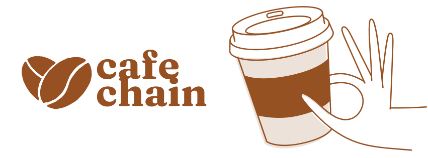
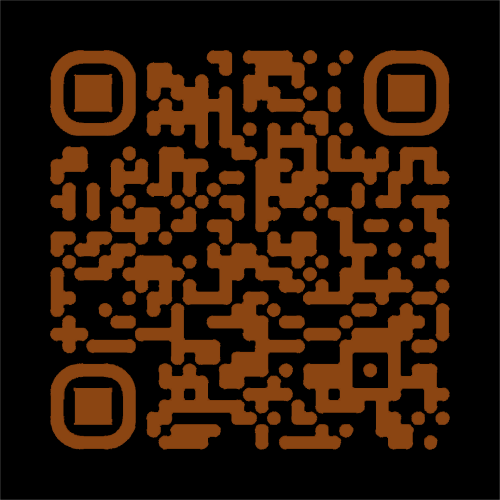

# ☕ CafeChain – Tracing Your Coffee from Farm to Cup

## Table of Contents  
- [About the Project](#about-the-project)  
- [Features](#features)  
- [How It Works](#how-it-works)  
- [Why CafeChain?](#why-cafechain)  
- [Built With](#built-with)  
- [License](#license)  

## About the Project  
**CafeChain** is a blockchain-based system designed to provide coffee consumers with full transparency about the journey of their coffee—from cultivation to consumption. This project was developed as my **master’s thesis** and focuses on the needs of coffee drinkers, rather than just supply chain participants.  

Most blockchain-based tracking systems cater exclusively to producers and distributors, leaving consumers uninformed. **CafeChain changes that**, offering an intuitive and accessible way to explore the origin and history of your favorite coffee.  

## Features  
### 🌱 **Cultivation & Harvesting**  
- Discover the exact origin of your coffee beans.  
- Learn about the variety, farming methods, and sustainability practices.  

### 🔄 **Processing & Transformation**  
- Track the drying and processing methods used to prepare your coffee.  

### 🚚 **Transport & Distribution**  
- Follow your coffee’s journey from farm to local stores or distribution points.  
- View transport details recorded on the blockchain for transparency.  

### 🛒 **Sales & Consumption**  
- Learn where your coffee was purchased and its complete journey from production to cup.  

## How It Works  
1. **Producers & Farmers**: Register coffee batches and link them to a unique **QR code**.  
2. **Suppliers & Retailers**: Provide product details for tracking and display QR codes.  
3. **Consumers**: Scan the QR code to instantly access the coffee’s history, including origin, processing, and distribution details.

## Example QR Code for a Coffee Batch:

## Why CafeChain?  
Unlike traditional tracking systems, **CafeChain** enhances transparency while fostering a deeper connection between consumers and coffee producers. It empowers consumers to make **informed choices**, appreciate the effort behind each cup, and support sustainable, ethical coffee production.  

By leveraging **blockchain technology**, the system guarantees authenticity, prevents data tampering, and promotes trust in the coffee supply chain.  

## Built With  
- **React** – Frontend for an interactive user experience
- **Solidity** – Smart contract development for tracking coffee batches  
- **Sepolia Testnet** – Ethereum test network for blockchain transactions  
- **Web3.js** – Interaction with the Ethereum blockchain  
- **QR Code Integration** – Unique identifiers for coffee tracking  

## License  
This project is licensed under the **MIT License**.  